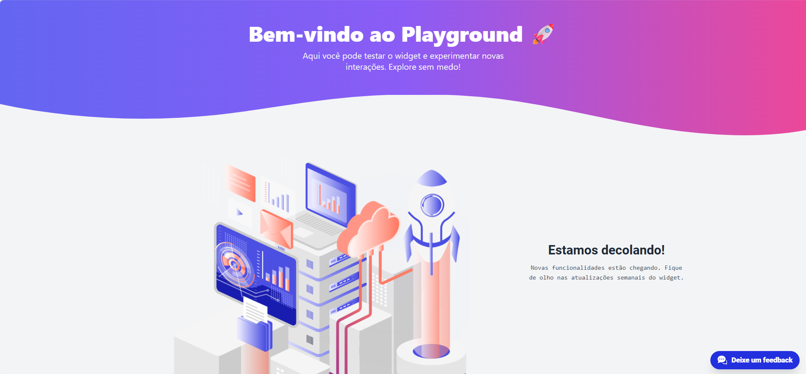
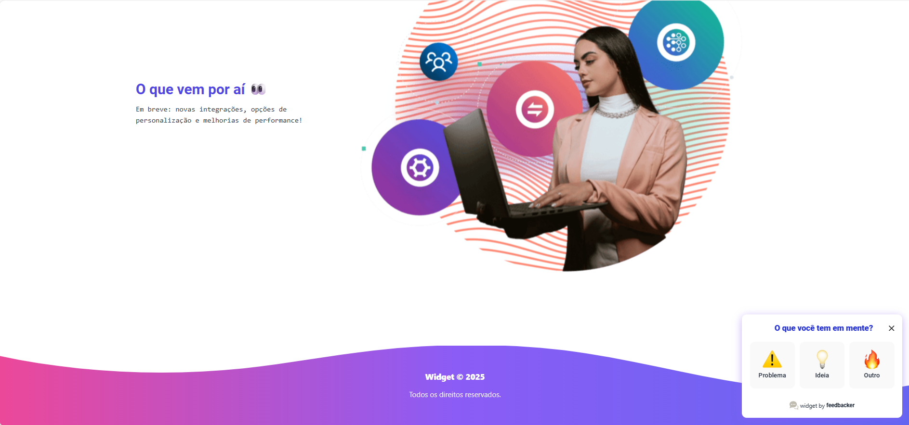

# Widget
> Este é um projeto de widget interativo para feedback desenvolvido com **Vue3**, **TypeScript** e **Tailwind CSS**, que pode ser integrado em qualquer página para coletar sugestões, ideias e problemas dos usuários. Possui testes unitários e E2E com **Jest** e **Cypress**.




## Instalação

### Instale as dependências

```
npm install
```

### Rode a aplicação localmente
```
npm run serve
```

## Testes

### Testes Unitários
```
npm run test:unit
```

###  Testes E2E com Cypress
```
npm run test:e2e
```


## Funcionalidades
✅ Widget responsivo e animado com Teleport.
✅ Coleta de feedback por tipo (ideia, problema, outro).
✅ Fechamento/abertura com comunicação via window.postMessage.
✅ Controle de navegação e estados internos via Store.
✅ Mock de iframe e integração em ambiente externo.
✅ Testes unitários + E2E.


## Licença

Este projeto está licenciado sob a Licença MIT. Consulte o arquivo LICENSE para mais informações.

Feito com ♥ por [Jezebel Guedes](https://www.linkedin.com/in/jezebel-guedes/) 👋 Entre em contato!
